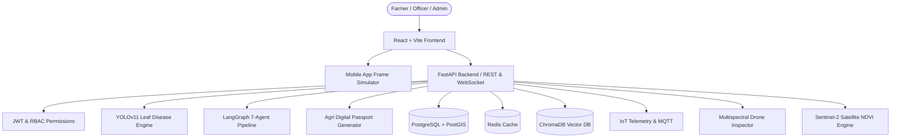

# 🌾 KrishiVerse AI – Smart Agriculture Ecosystem

> **Tagline:** *One AI Platform to Empower Every Farmer*

[](https://opensource.org/licenses/MIT)
[]()
[](https://fastapi.tiangolo.com)
[](https://reactjs.org)
[](https://ultralytics.com)
[](https://langchain.com)

---

## 🚀 Overview

**KrishiVerse AI** is an enterprise-grade **AI Operating System for Agriculture**. Designed to solve fragmented agricultural management, it unifies weather forecasting, computer vision disease diagnosis, soil analysis, smart irrigation, mandi market intelligence, government schemes, IoT telemetry, satellite NDVI monitoring, and multi-agent AI into a single, cohesive platform.

Built for global competitions including **Smart India Hackathon**, **Google Solution Challenge**, **Microsoft Imagine Cup**, **DRDO Innovation Challenge**, and venture startup demos.

---

## ⭐ Key Highlights & 1st-Prize Innovations

1. **Agri Digital Passport (1st-Prize Unique Module)**  
   Every farm gets a verified digital identity card featuring a unique QR code, soil health history, crop rotation timeline, carbon footprint score ($A^+$ Eco-Certified), and an AI Farm Health Score ($0 - 100$).
2. **AI Crop Doctor (YOLOv11 Neural Vision)**  
   Millisecond-level leaf disease, pest, and nutrient deficiency scanner with bounding box canvas overlays, organic remedies, chemical dosage calculations, and nearby agrochemical store locators.
3. **Multi-Agent AI Engine (LangGraph Architecture)**  
   Sequential execution pipeline: `Weather Agent` ➔ `Soil Agent` ➔ `Crop Agent` ➔ `Disease Agent` ➔ `Market Agent` ➔ `Finance Agent` ➔ `Government Scheme Agent` ➔ `Master AI Decision Synthesizer`.
4. **Multilingual Voice Assistant**  
   Native Web Speech API voice interaction supporting **Hindi (हिंदी)**, **Marathi (मराठी)**, **Telugu (తెలుగు)**, and **English** with real-time text-to-speech (TTS) & speech-to-text (STT).
5. **Multi-Role Portals & GIS Live Map**  
   Separate authenticated views for **Farmers**, **Agriculture Officers** (interactive Leaflet GIS maps, disease outbreak heatmaps, PDF report generators), and **System Administrators** (YOLOv11 & Gemini token monitoring).

---

## 🏗 System Architecture



---

## 📁 Repository Structure

```
.
├── backend/
│   ├── app/
│   │   ├── api/v1/          # REST & WebSocket API endpoints
│   │   ├── auth/            # JWT authentication & RBAC middleware
│   │   ├── database/        # schema.sql DDL script
│   │   ├── models/          # SQLAlchemy ORM models
│   │   ├── schemas/         # Pydantic validation schemas
│   │   ├── services/        # YOLOv11, LangGraph, Digital Passport services
│   │   ├── config.py        # Settings & environment variables
│   │   └── main.py          # FastAPI application entrypoint
│   ├── Dockerfile
│   └── requirements.txt
├── docs/
│   ├── API_DOCUMENTATION.md # OpenAPI endpoint reference
│   └── ER_DIAGRAM.md        # Database Entity-Relationship diagram
├── src/
│   ├── components/
│   │   ├── admin/           # Admin Dashboard & AI telemetry
│   │   ├── farmer/          # 12 AI Farmer tools & Digital Passport
│   │   ├── marketplace/     # Seeds, Fertilizers & Equipment rental
│   │   ├── modules/         # IoT, Drone & Satellite NDVI modules
│   │   ├── officer/         # Agriculture Officer GIS Map & Reports
│   │   ├── Navbar.jsx
│   │   └── VoiceAssistantModal.jsx
│   ├── data/
│   │   └── mockData.js      # Multilingual translations & sample datasets
│   ├── App.jsx              # App router & global state
│   ├── index.css            # Glassmorphism Emerald Design System
│   └── main.jsx
├── docker-compose.yml
├── Dockerfile
├── package.json
└── vite.config.js
```

---

## ⚡ Quick Start & Setup Guide

### Option A: Using Docker Compose (Recommended)

Run the entire multi-container stack (FastAPI + React Frontend + PostgreSQL + Redis + ChromaDB) with a single command:

```bash
docker-compose up --build
```
- **Web App:** `http://localhost:5173`
- **FastAPI Docs:** `http://localhost:8000/docs`

---

### Option B: Local Manual Setup

#### 1. Frontend Setup (React + Vite)
```bash
npm install
npm run dev
```
Open `http://localhost:5173` in your browser.

#### 2. Backend Setup (FastAPI + Python)
```bash
cd backend
python -m venv venv
# On Windows:
venv\Scripts\activate
# On Linux/macOS:
source venv/bin/activate

pip install -r requirements.txt
uvicorn app.main:app --reload --port 8000
```
API Documentation will be accessible at `http://localhost:8000/docs`.

---

## 📄 Documentation Links

- 🔗 [API Documentation](file:///c:/Users/mayur/OneDrive/Desktop/KrishiVerse%20AI%20%E2%80%93%20Smart%20Agriculture%20Ecosystem/docs/API_DOCUMENTATION.md)
- 🔗 [Database ER Diagram](file:///c:/Users/mayur/OneDrive/Desktop/KrishiVerse%20AI%20%E2%80%93%20Smart%20Agriculture%20Ecosystem/docs/ER_DIAGRAM.md)
- 🔗 [Database DDL Schema](file:///c:/Users/mayur/OneDrive/Desktop/KrishiVerse%20AI%20%E2%80%93%20Smart%20Agriculture%20Ecosystem/backend/database/schema.sql)

---

## 📜 License

Distributed under the MIT License. See `LICENSE` for more information.
