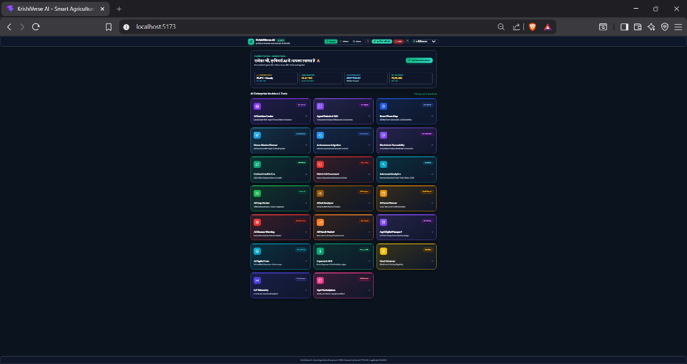

# 🌿 KrishiVerse AI – Smart Agriculture Ecosystem

> **1st Prize Enterprise AI SaaS Platform for Smart Agriculture, Autonomous IoT, & Multi-Agent Intelligence**



---

## ✨ Enterprise Features Overview

- 🤖 **LangGraph AI Decision Center**: Multi-agent reasoning graph (Weather, Soil, Crop, Disease, Market, Finance, Govt Scheme) synthesizing Master AI Decisions.
- 🧠 **Explainable AI (XAI) & Agent Debate**: Transparent multi-agent debate logs and confidence weight tree.
- 🌾 **2D Real Farm Layout & Satellite GIS Visualizer**: Real 2D vector schematic farmland canvas with Zone A/B/C/D plots, drip irrigation pipes, water tank, and IoT pins.
- 🚁 **Autonomous Drone Mission Planner**: UAV flight path waypoints & 4K multispectral weed/nitrogen scanner.
- 📊 **Advanced Analytics Dashboard**: Recharts multi-metric dashboard tracking Profit, Yield, Water, Disease, and ROI.
- 💧 **Autonomous IoT Irrigation Engine**: Solenoid valve actuators with closed-loop monsoon rain override rules.
- 🛒 **Agri B2B Marketplace & Equipment Rental**: Interactive cart drawer, GST (18%) calculator, and checkout receipt flow.
- ⛓️ **Blockchain Produce Traceability**: Immutable QR code hash timeline tracking produce batch provenance.
- 🌿 **Carbon Credit & Sustainability Dashboard**: ISO 14064 carbon sequestration & credit monetization estimator.
- 🏛️ **District & State AI Command Center**: Macro operations monitoring across registered regional farms.

---

## 🛠️ Architecture & Tech Stack

- **Frontend**: React 18, Vite 8, Tailwind CSS CDN, Recharts, Leaflet GIS, Lucide Icons
- **Backend Engine**: FastAPI (Python 3.11), PyTorch, YOLOv11 Computer Vision, LangGraph Multi-Agent Framework
- **Database & GIS**: PostgreSQL + PostGIS, Redis Cache, Docker Compose Orchestration

---

## 🚀 Quick Start Guide

### 1. Local Development (Frontend)
```bash
npm install
npm run dev
# App opens live at http://localhost:5173/
```

### 2. Production Build
```bash
npm run build
```

---

## 📄 License & Attribution
Designed & Engineered for **KrishiVerse AI Ecosystem © 2026**.
