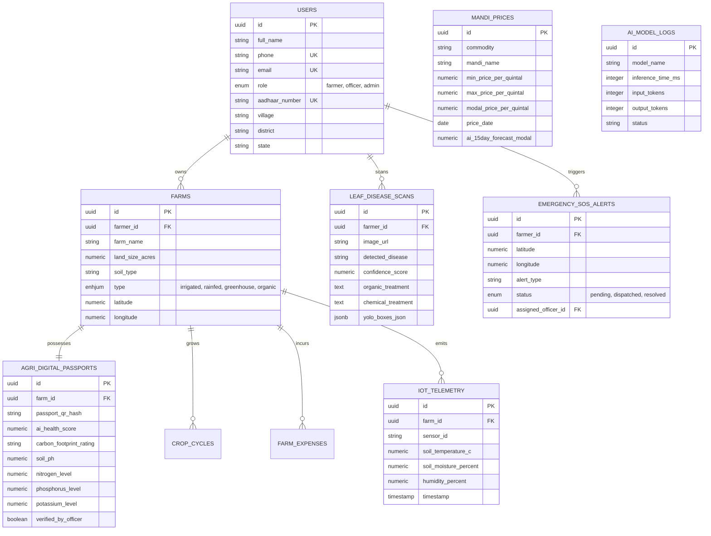

# KrishiVerse AI - Database Entity-Relationship (ER) Diagram

Below is the conceptual and relational schema of **KrishiVerse AI - Smart Agriculture Ecosystem**.

```mermaid
erDiagram
    USERS ||--o{ FARMS : "owns"
    USERS ||--o{ LEAF_DISEASE_SCANS : "scans"
    USERS ||--o{ EMERGENCY_SOS_ALERTS : "triggers"
    FARMS ||--|| AGRI_DIGITAL_PASSPORTS : "possesses"
    FARMS ||--o{ CROP_CYCLES : "grows"
    FARMS ||--o{ FARM_EXPENSES : "incurs"
    FARMS ||--o{ IOT_TELEMETRY : "emits"

    USERS {
        uuid id PK
        string full_name
        string phone UK
        string email UK
        enum role "farmer, officer, admin"
        string aadhaar_number UK
        string village
        string district
        string state
    }

    FARMS {
        uuid id PK
        uuid farmer_id FK
        string farm_name
        numeric land_size_acres
        string soil_type
        enhjum type "irrigated, rainfed, greenhouse, organic"
        numeric latitude
        numeric longitude
    }

    AGRI_DIGITAL_PASSPORTS {
        uuid id PK
        uuid farm_id FK
        string passport_qr_hash
        numeric ai_health_score
        string carbon_footprint_rating
        numeric soil_ph
        numeric nitrogen_level
        numeric phosphorus_level
        numeric potassium_level
        boolean verified_by_officer
    }

    LEAF_DISEASE_SCANS {
        uuid id PK
        uuid farmer_id FK
        string image_url
        string detected_disease
        numeric confidence_score
        text organic_treatment
        text chemical_treatment
        jsonb yolo_boxes_json
    }

    MANDI_PRICES {
        uuid id PK
        string commodity
        string mandi_name
        numeric min_price_per_quintal
        numeric max_price_per_quintal
        numeric modal_price_per_quintal
        date price_date
        numeric ai_15day_forecast_modal
    }

    IOT_TELEMETRY {
        uuid id PK
        uuid farm_id FK
        string sensor_id
        numeric soil_temperature_c
        numeric soil_moisture_percent
        numeric humidity_percent
        timestamp timestamp
    }

    EMERGENCY_SOS_ALERTS {
        uuid id PK
        uuid farmer_id FK
        numeric latitude
        numeric longitude
        string alert_type
        enum status "pending, dispatched, resolved"
        uuid assigned_officer_id FK
    }

    AI_MODEL_LOGS {
        uuid id PK
        string model_name
        integer inference_time_ms
        integer input_tokens
        integer output_tokens
        string status
    }
```
